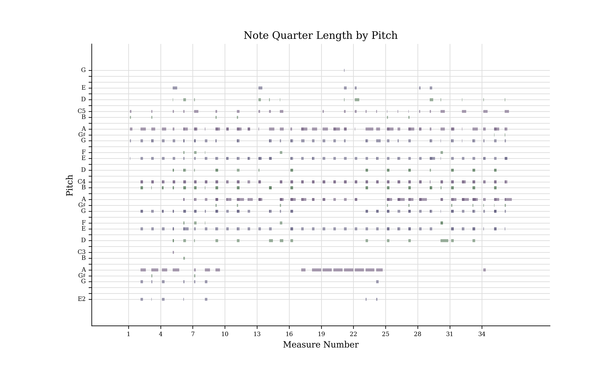
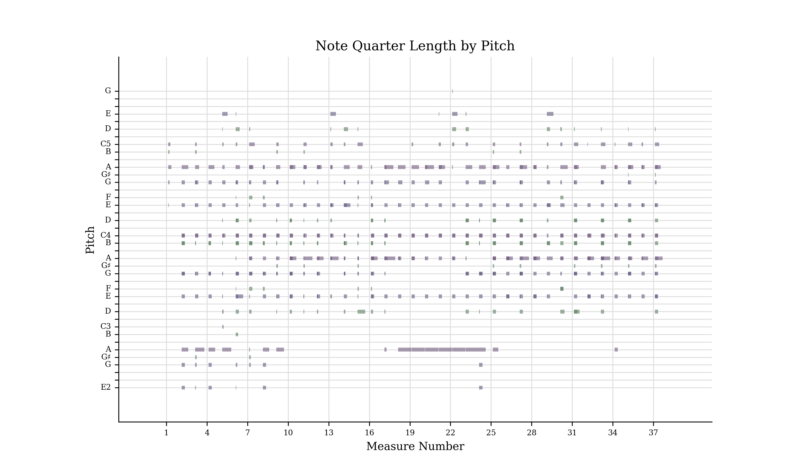

#EMS: an Expressive MIDI Serialiser

## Introduction

The MIDI (Musical Instrument Digital Interface) protocol is extremely useful - and awesome -  when we want to work with digital audio. One of its many utilities is in Machine Learning, where it allows us to train data models to generate musical pieces.
However, the current literature suffer from the lack of a tool that transcribes MIDI data to a model-friendly structure while preserving the whole expressive dimension of music.

EMS is being build to address that need. While simultaneously working on a LSTM that predict and translates musical data between instruments, our [PET](https://www.inf.ufrgs.br/site/pet/) group from the [Institute of Informatics](https://inf.ufrgs.br)  of the [Federal University of Rio Grande do Sul (UFRGS)](https://ufrgs.br) - Brazil, is maintaining and developing this repo.

 With the advances of [MIDI 2.0](https://www.midi.org/midi-articles/details-about-midi-2-0-midi-ci-profiles-and-property-exchange) in mind, we're working on merging concepts from Music Information Retrieval (MIR) and Machine Learning (ML) to prepare the ground for future works that can popularize the feeling of making music.


## The concept

The main idea behind the project is to represent a MIDI file in some format that is easy to manipulate and feed to a model, like a neural network.
Simply put, we transform the input file in a **Pandas DataFrame** with a column for every information we want to maintain.

There are currently 3 setting parameters for the serialisation process:
1. Resolution: this is the amount of *frames* that will represent every measure of the song.
2. Keyboard Size: this is the amount on *notes* that we'll be tracked by the serialiser.
3. Keyboard Offset: this is the *MIDI value* of the first key in our keyboard
   
An example of serialisation can be seen below. **False** means that the note is not played in that frame, while **True** means the opposite.


| INSTRUMENT   |   MIDI_CODE | KS   | TS   |   TEMPO | A0    | B-0   | B0    | C1    | C#1   | D1    | E-1   | E1    | F1    | F#1   | G1    | G#1   | A1    | B-1   | B1    | C2    | C#2   | D2    | E-2   | E2    | F2    | F#2   | G2    | G#2   | A2    | B-2   | B2    | C3    | C#3   | D3    | E-3   | E3    | F3    | F#3   | G3    | G#3   | A3    | B-3   | B3    | C4    | C#4   | D4    | E-4   | E4    | F4    | F#4   | G4    | G#4   | A4    | B-4   | B4    | C5    | C#5   | D5    | E-5   | E5    | F5    | F#5   | G5    | G#5   | A5    | B-5   | B5    | C6    | C#6   | D6    | E-6   | E6    | F6    | F#6   | G6    | G#6   | A6    | B-6   | B6    | C7    | C#7   | D7    | E-7   | E7    | F7    | F#7   | G7    | G#7   | A7    | B-7   | B7    | C8    |
|:-------------|------------:|:-----|:-----|--------:|:------|:------|:------|:------|:------|:------|:------|:------|:------|:------|:------|:------|:------|:------|:------|:------|:------|:------|:------|:------|:------|:------|:------|:------|:------|:------|:------|:------|:------|:------|:------|:------|:------|:------|:------|:------|:------|:------|:------|:------|:------|:------|:------|:------|:------|:------|:------|:------|:------|:------|:------|:------|:------|:------|:------|:------|:------|:------|:------|:------|:------|:------|:------|:------|:------|:------|:------|:------|:------|:------|:------|:------|:------|:------|:------|:------|:------|:------|:------|:------|:------|:------|:------|:------|:------|:------|:------|:------|
| Lead Guitar  |          28 | C    | 4/4  |      83 | False | False | False | False | False | False | False | False | False | False | False | False | False | False | False | False | False | False | False | False | False | False | False | False | False | False | False | False | False | False | False | False | False | False | False | False | False | False | False | False | False | False | False | False | False | False | False | False | False | False | False | False | False | False | False | False | False | False | False | False | False | False | False | False | False | False | False | False | False | False | False | False | False | False | False | False | False | False | False | False | False | False | False | False | False | False | False | False |
| Lead Guitar  |          28 | C    | 4/4  |      83 | False | False | False | False | False | False | False | False | False | False | False | False | False | False | False | False | False | False | False | False | False | False | False | False | False | False | False | False | False | False | False | False | False | False | False | False | False | False | False | False | False | False | False | False | False | False | False | False | False | False | False | False | False | False | False | False | False | False | False | False | False | False | False | False | False | False | False | False | False | False | False | False | False | False | False | False | False | False | False | False | False | False | False | False | False | False | False | False |
| Lead Guitar  |          28 | C    | 4/4  |      83 | False | False | False | False | False | False | False | False | False | False | False | False | False | False | False | False | False | False | False | False | False | False | False | False | False | False | False | False | False | False | False | False | False | False | False | False | False | False | False | False | False | False | False | False | False | False | False | False | False | False | False | False | False | False | False | False | False | False | False | False | False | False | False | False | False | False | False | False | False | False | False | False | False | False | False | False | False | False | False | False | False | False | False | False | False | False | False | False |
| Lead Guitar  |          28 | C    | 4/4  |      83 | False | False | False | False | False | False | False | False | False | False | False | False | False | False | False | False | False | False | False | False | False | False | False | False | False | False | False | False | False | False | False | False | False | False | False | False | False | False | False | False | False | False | False | False | False | False | False | False | False | False | False | False | False | False | False | False | False | False | False | False | False | False | False | False | False | False | False | False | False | False | False | False | False | False | False | False | False | False | False | False | False | False | False | False | False | False | False | False |
| Lead Guitar  |          28 | C    | 4/4  |      83 | False | False | False | False | False | False | False | False | False | False | False | False | False | False | False | False | False | False | False | False | False | False | False | False | False | False | False | False | False | False | False | False | False | False | False | False | False | False | False | False | False | False | False | False | False | False | False | False | False | False | False | False | False | False | False | False | False | False | False | False | False | False | False | False | False | False | False | False | False | False | False | False | False | False | False | False | False | False | False | False | False | False | False | False | False | False | False | False |
| Lead Guitar  |          28 | C    | 4/4  |      83 | False | False | False | False | False | False | False | False | False | False | False | False | False | False | False | False | False | False | False | False | False | False | False | False | False | False | False | False | False | False | False | False | False | False | False | False | False | False | False | False | False | False | False | False | False | False | False | False | False | False | False | False | False | False | False | False | False | False | False | False | False | False | False | False | False | False | False | False | False | False | False | False | False | False | False | False | False | False | False | False | False | False | False | False | False | False | False | False |
| Lead Guitar  |          28 | C    | 4/4  |      83 | False | False | False | False | False | False | False | False | False | False | False | False | False | False | False | False | False | False | False | False | False | False | False | False | False | False | False | False | False | False | False | False | False | False | False | False | False | False | False | False | False | False | False | False | False | False | False | False | False | False | False | False | False | False | False | False | False | False | False | False | False | False | False | False | False | False | False | False | False | False | False | False | False | False | False | False | False | False | False | False | False | False | False | False | False | False | False | False |
| Lead Guitar  |          28 | C    | 4/4  |      83 | False | False | False | False | False | False | False | False | False | False | False | False | False | False | False | False | False | False | False | False | False | False | False | False | False | False | False | False | False | False | False | False | False | False | False | False | False | False | False | False | False | False | False | False | False | False | False | False | False | False | False | False | False | False | False | False | False | False | False | False | False | False | False | False | False | False | False | False | False | False | False | False | False | False | False | False | False | False | False | False | False | False | False | False | False | False | False | False |
| Lead Guitar  |          28 | C    | 4/4  |      83 | False | False | False | False | False | False | False | False | False | False | False | False | False | False | False | False | False | False | False | False | False | False | False | False | False | False | False | False | False | False | False | False | False | False | False | False | False | False | False | False | False | False | False | False | False | False | False | False | False | False | False | False | False | False | False | False | False | False | False | False | False | False | False | False | False | False | False | False | False | False | False | False | False | False | False | False | False | False | False | False | False | False | False | False | False | False | False | False |
| Lead Guitar  |          28 | C    | 4/4  |      83 | False | False | False | False | False | False | False | False | False | False | False | False | False | False | False | False | False | False | False | False | False | False | False | False | False | False | False | False | False | False | False | False | False | False | False | False | False | False | False | False | False | False | False | False | False | False | False | False | False | False | False | False | False | False | False | False | False | False | False | False | False | False | False | False | False | False | False | False | False | False | False | False | False | False | False | False | False | False | False | False | False | False | False | False | False | False | False | False |

## Usage
First of all, you must import the package and define the settings for the serialiser.
```python
from EMS import serialisation, deserialisation

SETTINGS = {
    'RESOLUTION': 96,
    'KEYBOARD_SIZE': 88,
    'KEYBOARD_OFFSET': 21
}
```
Then, to serialise:
```python
serialised = serialisation.file('Steely Dan - Deacon Blues.mid',
                                SETTINGS,
                                save_as='serialised_file.pkl') ## optional
```
And retrieving back the MIDI format:
```python
deserialised = deserialisation.file(serialised,
                                    SETTINGS,
                                    save_as='deserialised_file.mid')
```

## Results
As the project is under development, results are quite weak. Nevertheless, one way of evaluating the success of the serialiser is by comparing the original file with the file after both serialization and deserialization.

Original:


Result with resolution of **36** frames per measure


Result with resolution of **96** frames per measure
