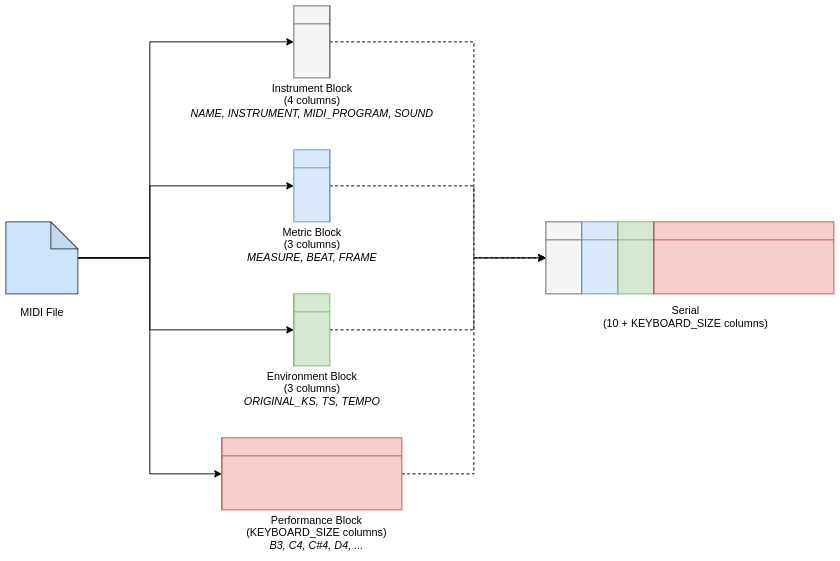
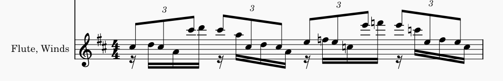

# EPMS: Expressive Polyphonic MIDI Serializer

## Introduction

The MIDI (Musical Instrument Digital Interface) protocol is extremely useful - and awesome -  when we want to work with digital audio. One of its many utilities is in
Machine Learning, where it allows us to train data models to generate musical pieces.
However, the current literature lack a tool that transcribes MIDI data to a model-friendly  structure while preserving
polyphony and the whole expressive dimension of music.

EPMS is being build to address that need. While simultaneously working on a  
LSTM that predict and translates musical data between instruments, our [PET](https://www.inf.ufrgs.br/site/pet/) group from the [Institute of Informatics](https://inf.ufrgs.br)  of the [Federal University of Rio Grande do Sul (UFRGS)](https://ufrgs.br) - Brazil, is maintaining and developing this repository.

 With the advances of [MIDI 2.0](https://www.midi.org/midi-articles/details-about-midi-2-0-midi-ci-profiles-and-property-exchange) in mind, we're working on merging concepts from Music Information Retrieval (MIR) and Machine Learning (ML) to prepare the ground for future works that can popularize the feeling of making music.


## The Concept

The main idea behind the project is to represent a MIDI file in some format that is easy to manipulate and feed to a Machine Learning (ML) model, like a neural network.
Simply put, we transform the input file in a **Pandas DataFrame** where information is stored.

### Settings
There are currently 3 setting parameters for the serialization process:
1. **RESOLUTION** (int): the amount of *frames per beat* to be recorded.  
2. **KEYBOARD_SIZE** (int): the amount on *notes* that we'll be tracked by the serializer.
3. **KEYBOARD_OFFSET** (int): the *MIDI value* of the first key in our keyboard

\
For example, we can set the serial parameters like

```python
SETTINGS = {
    'RESOLUTION': 16,
    'KEYBOARD_SIZE': 13,
    'KEYBOARD_OFFSET': 60
}
```

that will be internally transformed into a serie.

| SETTING | VALUE|
|:-----------|---|
| RESOLUTION | 16|
| KEYBOARD_SIZE | 13 |
| KEYBOARD_OFFSET | 60 |

### Serialization
Each row in the serial DataFrame corresponds to a **frame** of the song
and each frame is formed in a set of different *blocks*:
* the **Instrument Block**, that stores information about instrument qualities


| NAME   | INSTRUMENT   |   MIDI_PROGRAM | SOUND             |
|:-------|:-------------|---------------:|:------------------|


* the **Metric Block**, that will be our time reference across the song

|   MEASURE |   BEAT |   FRAME |
|:----------|:-------|---------|

* the **Environment Block**, that provides the musical context of one's model environment


| ORIGINAL_KS   | TS   |   TEMPO |
|:--------------|------|---------|


* and the **Performance Block**, that is a *piano-roll*-like representation that specifies one column for every
key in our model's 'artificial piano'. In this block we focus on representing the main
  expressive characteristics of human musical performances, such as *dynamics*, *syncopations* and *articulations*.
\
\
With the settings values as shown before,
the Performance Block would be:

| C4    | C#4   | D4    | E-4     | E4    | F4    | F#4   | G4 | G#4 | A4 | B-4 | B4 | C5 |
|:------|-------|-------|---------|-------|-------|-------|----|-----|----|-----|----|----|


\
\
Finally, our frames will contain MIDI data in the following columns:

| NAME   | INSTRUMENT   |   MIDI_PROGRAM | SOUND             |   MEASURE |   BEAT |   FRAME | ORIGINAL_KS   | TS   |   TEMPO | A0    | B-0   | B0    | C1    | C#1   | D1    | E-1   | E1    | F1    | F#1   | G1    | G#1   | A1    | B-1   | B1    | C2    | C#2   | D2    | E-2   | E2    | F2    | F#2   | G2    | G#2   | A2    | B-2   | B2    | C3    | C#3   | D3    | E-3   | E3    | F3    | F#3   | G3    | G#3   | A3    | B-3   | B3    | C4    | C#4   | D4    | E-4   | E4    | F4    | F#4   | G4    | G#4   | A4                          | B-4   | B4    | C5                          | C#5                         | D5                          | E-5   | E5                          | F5                          | F#5   | G5    | G#5   | A5                          | B-5   | B5    | C6                          | C#6                         | D6                          | E-6   | E6                          | F6                          | F#6   | G6    | G#6   | A6    | B-6   | B6    | C7    | C#7   | D7    | E-7   | E7    | F7    | F#7   | G7    | G#7   | A7    | B-7   | B7    | C8    |
|:-------|:-------------|---------------:|:------------------|----------:|-------:|--------:|:--------------|:-----|--------:|:------|:------|:------|:------|:------|:------|:------|:------|:------|:------|:------|:------|:------|:------|:------|:------|:------|:------|:------|:------|:------|:------|:------|:------|:------|:------|:------|:------|:------|:------|:------|:------|:------|:------|:------|:------|:------|:------|:------|:------|:------|:------|:------|:------|:------|:------|:------|:------|:----------------------------|:------|:------|:----------------------------|:----------------------------|:----------------------------|:------|:----------------------------|:----------------------------|:------|:------|:------|:----------------------------|:------|:------|:----------------------------|:----------------------------|:----------------------------|:------|:----------------------------|:----------------------------|:------|:------|:------|:------|:------|:------|:------|:------|:------|:------|:------|:------|:------|:------|:------|:------|:------|:------|:------|


### Serialization Diagram



## Performance Block (PB) Representation
As a group project decision, the values stored in the PB are formatted in a way that we can
easily turn one row (one frame) into a **Multi Hot Encoded Performance (MHEP) frame**, that can be
used as input vector for a model that uses Binary Cross Entropy Loss (BCE Loss) to get a rapidly convergent
*'what notes should I play?'* kind of learning. The main point of this decision is that this way we
treat the playing problem as a Classification Problem, that is easier to work on.

In that sense, the data inside the PB is represented in a way where different data types provide
different semantic meaning for a note's frame in the performance encoding:

> ### **Boolean**
>
> **False**: represent silence, the note is not being played in the frame.


> ### Float32
>
> *****value*****: represent that this note is playing in the frame with current scalar velocity *****value*****.

* ****

## Usage and Example
First of all, you must import the package and define the settings for the serializer.
```python
from EMS import serialization, deserialization

SETTINGS = {
    'RESOLUTION': 16,
    'KEYBOARD_SIZE': 88,
    'KEYBOARD_OFFSET': 21
}
```
Then, to serialize:
```python
serial = serialization.file('test_midi_files/George Benson - Breezin.mid',
                            SETTINGS,
                            save_as='serial.pkl') ## optional
```
The following is the score for the first flute measure of George Bensons - Breezin:


  
The serial version of this measure can be seen below, it is a Pandas DataFrame with dimensions (64, 98):

| NAME   | INSTRUMENT   |   MIDI_PROGRAM | SOUND             |   MEASURE |   BEAT |   FRAME | ORIGINAL_KS   | TS   |   TEMPO | A0    | B-0   | B0    | C1    | C#1   | D1    | E-1   | E1    | F1    | F#1   | G1    | G#1   | A1    | B-1   | B1    | C2    | C#2   | D2    | E-2   | E2    | F2    | F#2   | G2    | G#2   | A2    | B-2   | B2    | C3    | C#3   | D3    | E-3   | E3    | F3    | F#3   | G3    | G#3   | A3    | B-3   | B3    | C4    | C#4   | D4    | E-4   | E4    | F4    | F#4   | G4    | G#4   |       A4 | B-4   | B4    |       C5 |      C#5 |       D5 | E-5   |       E5 |       F5 | F#5   | G5    | G#5   |       A5 | B-5   | B5    |       C6 |      C#6 |       D6 | E-6   |       E6 |       F6 | F#6   | G6    | G#6   | A6    | B-6   | B6    | C7    | C#7   | D7    | E-7   | E7    | F7    | F#7   | G7    | G#7   | A7    | B-7   | B7    | C8    |
|:-------|:-------------|---------------:|:------------------|----------:|-------:|--------:|:--------------|:-----|--------:|:------|:------|:------|:------|:------|:------|:------|:------|:------|:------|:------|:------|:------|:------|:------|:------|:------|:------|:------|:------|:------|:------|:------|:------|:------|:------|:------|:------|:------|:------|:------|:------|:------|:------|:------|:------|:------|:------|:------|:------|:------|:------|:------|:------|:------|:------|:------|:------|---------:|:------|:------|---------:|---------:|---------:|:------|---------:|---------:|:------|:------|:------|---------:|:------|:------|---------:|---------:|---------:|:------|---------:|---------:|:------|:------|:------|:------|:------|:------|:------|:------|:------|:------|:------|:------|:------|:------|:------|:------|:------|:------|:------|
| Winds  | Flute        |             73 | wind.flutes.flute |         1 |      1 |       1 | C             | 4/4  |      82 | False | False | False | False | False | False | False | False | False | False | False | False | False | False | False | False | False | False | False | False | False | False | False | False | False | False | False | False | False | False | False | False | False | False | False | False | False | False | False | False | False | False | False | False | False | False | False | False | 0        | False | False | 0        | 0.385827 | 0        | False | 0        | 0        | False | False | False | 0        | False | False | 0        | 0        | 0        | False | 0        | 0        | False | False | False | False | False | False | False | False | False | False | False | False | False | False | False | False | False | False | False |
| Winds  | Flute        |             73 | wind.flutes.flute |         1 |      1 |       2 | C             | 4/4  |      82 | False | False | False | False | False | False | False | False | False | False | False | False | False | False | False | False | False | False | False | False | False | False | False | False | False | False | False | False | False | False | False | False | False | False | False | False | False | False | False | False | False | False | False | False | False | False | False | False | 0        | False | False | 0        | 0.385827 | 0        | False | 0        | 0        | False | False | False | 0        | False | False | 0        | 0        | 0        | False | 0        | 0        | False | False | False | False | False | False | False | False | False | False | False | False | False | False | False | False | False | False | False |
| Winds  | Flute        |             73 | wind.flutes.flute |         1 |      1 |       3 | C             | 4/4  |      82 | False | False | False | False | False | False | False | False | False | False | False | False | False | False | False | False | False | False | False | False | False | False | False | False | False | False | False | False | False | False | False | False | False | False | False | False | False | False | False | False | False | False | False | False | False | False | False | False | 0        | False | False | 0        | 0.385827 | 0        | False | 0        | 0        | False | False | False | 0        | False | False | 0        | 0        | 0        | False | 0        | 0        | False | False | False | False | False | False | False | False | False | False | False | False | False | False | False | False | False | False | False |
| Winds  | Flute        |             73 | wind.flutes.flute |         1 |      1 |       4 | C             | 4/4  |      82 | False | False | False | False | False | False | False | False | False | False | False | False | False | False | False | False | False | False | False | False | False | False | False | False | False | False | False | False | False | False | False | False | False | False | False | False | False | False | False | False | False | False | False | False | False | False | False | False | 0        | False | False | 0        | 0.385827 | 0        | False | 0        | 0        | False | False | False | 0        | False | False | 0        | 0        | 0        | False | 0        | 0        | False | False | False | False | False | False | False | False | False | False | False | False | False | False | False | False | False | False | False |
| Winds  | Flute        |             73 | wind.flutes.flute |         1 |      1 |       5 | C             | 4/4  |      82 | False | False | False | False | False | False | False | False | False | False | False | False | False | False | False | False | False | False | False | False | False | False | False | False | False | False | False | False | False | False | False | False | False | False | False | False | False | False | False | False | False | False | False | False | False | False | False | False | 0        | False | False | 0        | 0        | 0.385827 | False | 0        | 0        | False | False | False | 0        | False | False | 0        | 0        | 0        | False | 0        | 0        | False | False | False | False | False | False | False | False | False | False | False | False | False | False | False | False | False | False | False |
| Winds  | Flute        |             73 | wind.flutes.flute |         1 |      1 |       6 | C             | 4/4  |      82 | False | False | False | False | False | False | False | False | False | False | False | False | False | False | False | False | False | False | False | False | False | False | False | False | False | False | False | False | False | False | False | False | False | False | False | False | False | False | False | False | False | False | False | False | False | False | False | False | 0        | False | False | 0        | 0.503937 | 0.385827 | False | 0        | 0        | False | False | False | 0        | False | False | 0        | 0        | 0        | False | 0        | 0        | False | False | False | False | False | False | False | False | False | False | False | False | False | False | False | False | False | False | False |
| Winds  | Flute        |             73 | wind.flutes.flute |         1 |      1 |       7 | C             | 4/4  |      82 | False | False | False | False | False | False | False | False | False | False | False | False | False | False | False | False | False | False | False | False | False | False | False | False | False | False | False | False | False | False | False | False | False | False | False | False | False | False | False | False | False | False | False | False | False | False | False | False | 0        | False | False | 0        | 0.503937 | 0.385827 | False | 0        | 0        | False | False | False | 0        | False | False | 0        | 0        | 0        | False | 0        | 0        | False | False | False | False | False | False | False | False | False | False | False | False | False | False | False | False | False | False | False |
| Winds  | Flute        |             73 | wind.flutes.flute |         1 |      1 |       8 | C             | 4/4  |      82 | False | False | False | False | False | False | False | False | False | False | False | False | False | False | False | False | False | False | False | False | False | False | False | False | False | False | False | False | False | False | False | False | False | False | False | False | False | False | False | False | False | False | False | False | False | False | False | False | 0        | False | False | 0        | 0.503937 | 0.385827 | False | 0        | 0        | False | False | False | 0        | False | False | 0        | 0        | 0        | False | 0        | 0        | False | False | False | False | False | False | False | False | False | False | False | False | False | False | False | False | False | False | False |
| Winds  | Flute        |             73 | wind.flutes.flute |         1 |      1 |       9 | C             | 4/4  |      82 | False | False | False | False | False | False | False | False | False | False | False | False | False | False | False | False | False | False | False | False | False | False | False | False | False | False | False | False | False | False | False | False | False | False | False | False | False | False | False | False | False | False | False | False | False | False | False | False | 0.503937 | False | False | 0        | 0.503937 | 0        | False | 0        | 0        | False | False | False | 0        | False | False | 0        | 0        | 0        | False | 0        | 0        | False | False | False | False | False | False | False | False | False | False | False | False | False | False | False | False | False | False | False |
| Winds  | Flute        |             73 | wind.flutes.flute |         1 |      1 |      10 | C             | 4/4  |      82 | False | False | False | False | False | False | False | False | False | False | False | False | False | False | False | False | False | False | False | False | False | False | False | False | False | False | False | False | False | False | False | False | False | False | False | False | False | False | False | False | False | False | False | False | False | False | False | False | 0.503937 | False | False | 0        | 0        | 0        | False | 0        | 0        | False | False | False | 0        | False | False | 0        | 0        | 0        | False | 0        | 0        | False | False | False | False | False | False | False | False | False | False | False | False | False | False | False | False | False | False | False |
| Winds  | Flute        |             73 | wind.flutes.flute |         1 |      1 |      11 | C             | 4/4  |      82 | False | False | False | False | False | False | False | False | False | False | False | False | False | False | False | False | False | False | False | False | False | False | False | False | False | False | False | False | False | False | False | False | False | False | False | False | False | False | False | False | False | False | False | False | False | False | False | False | 0.503937 | False | False | 0        | 0        | 0        | False | 0        | 0        | False | False | False | 0        | False | False | 0        | 0.385827 | 0        | False | 0        | 0        | False | False | False | False | False | False | False | False | False | False | False | False | False | False | False | False | False | False | False |
| Winds  | Flute        |             73 | wind.flutes.flute |         1 |      1 |      12 | C             | 4/4  |      82 | False | False | False | False | False | False | False | False | False | False | False | False | False | False | False | False | False | False | False | False | False | False | False | False | False | False | False | False | False | False | False | False | False | False | False | False | False | False | False | False | False | False | False | False | False | False | False | False | 0.503937 | False | False | 0        | 0        | 0        | False | 0        | 0        | False | False | False | 0        | False | False | 0        | 0.385827 | 0        | False | 0        | 0        | False | False | False | False | False | False | False | False | False | False | False | False | False | False | False | False | False | False | False |
| Winds  | Flute        |             73 | wind.flutes.flute |         1 |      1 |      13 | C             | 4/4  |      82 | False | False | False | False | False | False | False | False | False | False | False | False | False | False | False | False | False | False | False | False | False | False | False | False | False | False | False | False | False | False | False | False | False | False | False | False | False | False | False | False | False | False | False | False | False | False | False | False | 0        | False | False | 0        | 0        | 0        | False | 0        | 0        | False | False | False | 0        | False | False | 0        | 0.385827 | 0.503937 | False | 0        | 0        | False | False | False | False | False | False | False | False | False | False | False | False | False | False | False | False | False | False | False |
| Winds  | Flute        |             73 | wind.flutes.flute |         1 |      1 |      14 | C             | 4/4  |      82 | False | False | False | False | False | False | False | False | False | False | False | False | False | False | False | False | False | False | False | False | False | False | False | False | False | False | False | False | False | False | False | False | False | False | False | False | False | False | False | False | False | False | False | False | False | False | False | False | 0        | False | False | 0        | 0        | 0        | False | 0        | 0        | False | False | False | 0        | False | False | 0        | 0.385827 | 0.503937 | False | 0        | 0        | False | False | False | False | False | False | False | False | False | False | False | False | False | False | False | False | False | False | False |
| Winds  | Flute        |             73 | wind.flutes.flute |         1 |      1 |      15 | C             | 4/4  |      82 | False | False | False | False | False | False | False | False | False | False | False | False | False | False | False | False | False | False | False | False | False | False | False | False | False | False | False | False | False | False | False | False | False | False | False | False | False | False | False | False | False | False | False | False | False | False | False | False | 0        | False | False | 0        | 0        | 0        | False | 0        | 0        | False | False | False | 0        | False | False | 0        | 0        | 0.503937 | False | 0        | 0        | False | False | False | False | False | False | False | False | False | False | False | False | False | False | False | False | False | False | False |
| Winds  | Flute        |             73 | wind.flutes.flute |         1 |      1 |      16 | C             | 4/4  |      82 | False | False | False | False | False | False | False | False | False | False | False | False | False | False | False | False | False | False | False | False | False | False | False | False | False | False | False | False | False | False | False | False | False | False | False | False | False | False | False | False | False | False | False | False | False | False | False | False | 0        | False | False | 0        | 0        | 0        | False | 0        | 0        | False | False | False | 0        | False | False | 0        | 0        | 0.503937 | False | 0        | 0        | False | False | False | False | False | False | False | False | False | False | False | False | False | False | False | False | False | False | False |
| Winds  | Flute        |             73 | wind.flutes.flute |         1 |      2 |       1 | C             | 4/4  |      82 | False | False | False | False | False | False | False | False | False | False | False | False | False | False | False | False | False | False | False | False | False | False | False | False | False | False | False | False | False | False | False | False | False | False | False | False | False | False | False | False | False | False | False | False | False | False | False | False | 0        | False | False | 0        | 0        | 0        | False | 0        | 0        | False | False | False | 0        | False | False | 0        | 0.385827 | 0        | False | 0        | 0        | False | False | False | False | False | False | False | False | False | False | False | False | False | False | False | False | False | False | False |
| Winds  | Flute        |             73 | wind.flutes.flute |         1 |      2 |       2 | C             | 4/4  |      82 | False | False | False | False | False | False | False | False | False | False | False | False | False | False | False | False | False | False | False | False | False | False | False | False | False | False | False | False | False | False | False | False | False | False | False | False | False | False | False | False | False | False | False | False | False | False | False | False | 0        | False | False | 0        | 0        | 0        | False | 0        | 0        | False | False | False | 0        | False | False | 0        | 0.385827 | 0        | False | 0        | 0        | False | False | False | False | False | False | False | False | False | False | False | False | False | False | False | False | False | False | False |
| Winds  | Flute        |             73 | wind.flutes.flute |         1 |      2 |       3 | C             | 4/4  |      82 | False | False | False | False | False | False | False | False | False | False | False | False | False | False | False | False | False | False | False | False | False | False | False | False | False | False | False | False | False | False | False | False | False | False | False | False | False | False | False | False | False | False | False | False | False | False | False | False | 0        | False | False | 0        | 0        | 0        | False | 0        | 0        | False | False | False | 0        | False | False | 0        | 0.385827 | 0        | False | 0        | 0        | False | False | False | False | False | False | False | False | False | False | False | False | False | False | False | False | False | False | False |
| Winds  | Flute        |             73 | wind.flutes.flute |         1 |      2 |       4 | C             | 4/4  |      82 | False | False | False | False | False | False | False | False | False | False | False | False | False | False | False | False | False | False | False | False | False | False | False | False | False | False | False | False | False | False | False | False | False | False | False | False | False | False | False | False | False | False | False | False | False | False | False | False | 0        | False | False | 0        | 0        | 0        | False | 0        | 0        | False | False | False | 0        | False | False | 0        | 0.385827 | 0        | False | 0        | 0        | False | False | False | False | False | False | False | False | False | False | False | False | False | False | False | False | False | False | False |
| Winds  | Flute        |             73 | wind.flutes.flute |         1 |      2 |       5 | C             | 4/4  |      82 | False | False | False | False | False | False | False | False | False | False | False | False | False | False | False | False | False | False | False | False | False | False | False | False | False | False | False | False | False | False | False | False | False | False | False | False | False | False | False | False | False | False | False | False | False | False | False | False | 0        | False | False | 0        | 0        | 0        | False | 0        | 0        | False | False | False | 0.503937 | False | False | 0        | 0        | 0        | False | 0        | 0        | False | False | False | False | False | False | False | False | False | False | False | False | False | False | False | False | False | False | False |
| Winds  | Flute        |             73 | wind.flutes.flute |         1 |      2 |       6 | C             | 4/4  |      82 | False | False | False | False | False | False | False | False | False | False | False | False | False | False | False | False | False | False | False | False | False | False | False | False | False | False | False | False | False | False | False | False | False | False | False | False | False | False | False | False | False | False | False | False | False | False | False | False | 0        | False | False | 0        | 0.503937 | 0        | False | 0        | 0        | False | False | False | 0.503937 | False | False | 0        | 0        | 0        | False | 0        | 0        | False | False | False | False | False | False | False | False | False | False | False | False | False | False | False | False | False | False | False |
| Winds  | Flute        |             73 | wind.flutes.flute |         1 |      2 |       7 | C             | 4/4  |      82 | False | False | False | False | False | False | False | False | False | False | False | False | False | False | False | False | False | False | False | False | False | False | False | False | False | False | False | False | False | False | False | False | False | False | False | False | False | False | False | False | False | False | False | False | False | False | False | False | 0        | False | False | 0        | 0.503937 | 0        | False | 0        | 0        | False | False | False | 0.503937 | False | False | 0        | 0        | 0        | False | 0        | 0        | False | False | False | False | False | False | False | False | False | False | False | False | False | False | False | False | False | False | False |
| Winds  | Flute        |             73 | wind.flutes.flute |         1 |      2 |       8 | C             | 4/4  |      82 | False | False | False | False | False | False | False | False | False | False | False | False | False | False | False | False | False | False | False | False | False | False | False | False | False | False | False | False | False | False | False | False | False | False | False | False | False | False | False | False | False | False | False | False | False | False | False | False | 0        | False | False | 0        | 0.503937 | 0        | False | 0        | 0        | False | False | False | 0.503937 | False | False | 0        | 0        | 0        | False | 0        | 0        | False | False | False | False | False | False | False | False | False | False | False | False | False | False | False | False | False | False | False |
| Winds  | Flute        |             73 | wind.flutes.flute |         1 |      2 |       9 | C             | 4/4  |      82 | False | False | False | False | False | False | False | False | False | False | False | False | False | False | False | False | False | False | False | False | False | False | False | False | False | False | False | False | False | False | False | False | False | False | False | False | False | False | False | False | False | False | False | False | False | False | False | False | 0        | False | False | 0        | 0.503937 | 0.503937 | False | 0        | 0        | False | False | False | 0        | False | False | 0        | 0        | 0        | False | 0        | 0        | False | False | False | False | False | False | False | False | False | False | False | False | False | False | False | False | False | False | False |
| Winds  | Flute        |             73 | wind.flutes.flute |         1 |      2 |      10 | C             | 4/4  |      82 | False | False | False | False | False | False | False | False | False | False | False | False | False | False | False | False | False | False | False | False | False | False | False | False | False | False | False | False | False | False | False | False | False | False | False | False | False | False | False | False | False | False | False | False | False | False | False | False | 0        | False | False | 0        | 0        | 0.503937 | False | 0        | 0        | False | False | False | 0        | False | False | 0        | 0        | 0        | False | 0        | 0        | False | False | False | False | False | False | False | False | False | False | False | False | False | False | False | False | False | False | False |
| Winds  | Flute        |             73 | wind.flutes.flute |         1 |      2 |      11 | C             | 4/4  |      82 | False | False | False | False | False | False | False | False | False | False | False | False | False | False | False | False | False | False | False | False | False | False | False | False | False | False | False | False | False | False | False | False | False | False | False | False | False | False | False | False | False | False | False | False | False | False | False | False | 0        | False | False | 0        | 0.503937 | 0.503937 | False | 0        | 0        | False | False | False | 0        | False | False | 0        | 0        | 0        | False | 0        | 0        | False | False | False | False | False | False | False | False | False | False | False | False | False | False | False | False | False | False | False |
| Winds  | Flute        |             73 | wind.flutes.flute |         1 |      2 |      12 | C             | 4/4  |      82 | False | False | False | False | False | False | False | False | False | False | False | False | False | False | False | False | False | False | False | False | False | False | False | False | False | False | False | False | False | False | False | False | False | False | False | False | False | False | False | False | False | False | False | False | False | False | False | False | 0        | False | False | 0        | 0.503937 | 0.503937 | False | 0        | 0        | False | False | False | 0        | False | False | 0        | 0        | 0        | False | 0        | 0        | False | False | False | False | False | False | False | False | False | False | False | False | False | False | False | False | False | False | False |
| Winds  | Flute        |             73 | wind.flutes.flute |         1 |      2 |      13 | C             | 4/4  |      82 | False | False | False | False | False | False | False | False | False | False | False | False | False | False | False | False | False | False | False | False | False | False | False | False | False | False | False | False | False | False | False | False | False | False | False | False | False | False | False | False | False | False | False | False | False | False | False | False | 0.503937 | False | False | 0        | 0.503937 | 0        | False | 0        | 0        | False | False | False | 0        | False | False | 0        | 0        | 0        | False | 0        | 0        | False | False | False | False | False | False | False | False | False | False | False | False | False | False | False | False | False | False | False |
| Winds  | Flute        |             73 | wind.flutes.flute |         1 |      2 |      14 | C             | 4/4  |      82 | False | False | False | False | False | False | False | False | False | False | False | False | False | False | False | False | False | False | False | False | False | False | False | False | False | False | False | False | False | False | False | False | False | False | False | False | False | False | False | False | False | False | False | False | False | False | False | False | 0.503937 | False | False | 0        | 0.503937 | 0        | False | 0        | 0        | False | False | False | 0        | False | False | 0        | 0        | 0        | False | 0        | 0        | False | False | False | False | False | False | False | False | False | False | False | False | False | False | False | False | False | False | False |
| Winds  | Flute        |             73 | wind.flutes.flute |         1 |      2 |      15 | C             | 4/4  |      82 | False | False | False | False | False | False | False | False | False | False | False | False | False | False | False | False | False | False | False | False | False | False | False | False | False | False | False | False | False | False | False | False | False | False | False | False | False | False | False | False | False | False | False | False | False | False | False | False | 0.503937 | False | False | 0        | 0        | 0        | False | 0        | 0        | False | False | False | 0        | False | False | 0        | 0        | 0        | False | 0        | 0        | False | False | False | False | False | False | False | False | False | False | False | False | False | False | False | False | False | False | False |
| Winds  | Flute        |             73 | wind.flutes.flute |         1 |      2 |      16 | C             | 4/4  |      82 | False | False | False | False | False | False | False | False | False | False | False | False | False | False | False | False | False | False | False | False | False | False | False | False | False | False | False | False | False | False | False | False | False | False | False | False | False | False | False | False | False | False | False | False | False | False | False | False | 0.503937 | False | False | 0        | 0        | 0        | False | 0        | 0        | False | False | False | 0        | False | False | 0        | 0        | 0        | False | 0        | 0        | False | False | False | False | False | False | False | False | False | False | False | False | False | False | False | False | False | False | False |
| Winds  | Flute        |             73 | wind.flutes.flute |         1 |      3 |       1 | C             | 4/4  |      82 | False | False | False | False | False | False | False | False | False | False | False | False | False | False | False | False | False | False | False | False | False | False | False | False | False | False | False | False | False | False | False | False | False | False | False | False | False | False | False | False | False | False | False | False | False | False | False | False | 0        | False | False | 0        | 0        | 0        | False | 0.629921 | 0        | False | False | False | 0        | False | False | 0        | 0        | 0        | False | 0        | 0        | False | False | False | False | False | False | False | False | False | False | False | False | False | False | False | False | False | False | False |
| Winds  | Flute        |             73 | wind.flutes.flute |         1 |      3 |       2 | C             | 4/4  |      82 | False | False | False | False | False | False | False | False | False | False | False | False | False | False | False | False | False | False | False | False | False | False | False | False | False | False | False | False | False | False | False | False | False | False | False | False | False | False | False | False | False | False | False | False | False | False | False | False | 0        | False | False | 0        | 0        | 0        | False | 0.629921 | 0        | False | False | False | 0        | False | False | 0        | 0        | 0        | False | 0        | 0        | False | False | False | False | False | False | False | False | False | False | False | False | False | False | False | False | False | False | False |
| Winds  | Flute        |             73 | wind.flutes.flute |         1 |      3 |       3 | C             | 4/4  |      82 | False | False | False | False | False | False | False | False | False | False | False | False | False | False | False | False | False | False | False | False | False | False | False | False | False | False | False | False | False | False | False | False | False | False | False | False | False | False | False | False | False | False | False | False | False | False | False | False | 0        | False | False | 0        | 0        | 0        | False | 0.629921 | 0        | False | False | False | 0        | False | False | 0        | 0        | 0        | False | 0        | 0        | False | False | False | False | False | False | False | False | False | False | False | False | False | False | False | False | False | False | False |
| Winds  | Flute        |             73 | wind.flutes.flute |         1 |      3 |       4 | C             | 4/4  |      82 | False | False | False | False | False | False | False | False | False | False | False | False | False | False | False | False | False | False | False | False | False | False | False | False | False | False | False | False | False | False | False | False | False | False | False | False | False | False | False | False | False | False | False | False | False | False | False | False | 0        | False | False | 0        | 0        | 0        | False | 0.629921 | 0        | False | False | False | 0        | False | False | 0        | 0        | 0        | False | 0        | 0        | False | False | False | False | False | False | False | False | False | False | False | False | False | False | False | False | False | False | False |
| Winds  | Flute        |             73 | wind.flutes.flute |         1 |      3 |       5 | C             | 4/4  |      82 | False | False | False | False | False | False | False | False | False | False | False | False | False | False | False | False | False | False | False | False | False | False | False | False | False | False | False | False | False | False | False | False | False | False | False | False | False | False | False | False | False | False | False | False | False | False | False | False | 0        | False | False | 0        | 0        | 0        | False | 0        | 0.629921 | False | False | False | 0        | False | False | 0        | 0        | 0        | False | 0        | 0        | False | False | False | False | False | False | False | False | False | False | False | False | False | False | False | False | False | False | False |
| Winds  | Flute        |             73 | wind.flutes.flute |         1 |      3 |       6 | C             | 4/4  |      82 | False | False | False | False | False | False | False | False | False | False | False | False | False | False | False | False | False | False | False | False | False | False | False | False | False | False | False | False | False | False | False | False | False | False | False | False | False | False | False | False | False | False | False | False | False | False | False | False | 0        | False | False | 0        | 0        | 0        | False | 0.629921 | 0.629921 | False | False | False | 0        | False | False | 0        | 0        | 0        | False | 0        | 0        | False | False | False | False | False | False | False | False | False | False | False | False | False | False | False | False | False | False | False |
| Winds  | Flute        |             73 | wind.flutes.flute |         1 |      3 |       7 | C             | 4/4  |      82 | False | False | False | False | False | False | False | False | False | False | False | False | False | False | False | False | False | False | False | False | False | False | False | False | False | False | False | False | False | False | False | False | False | False | False | False | False | False | False | False | False | False | False | False | False | False | False | False | 0        | False | False | 0        | 0        | 0        | False | 0.629921 | 0.629921 | False | False | False | 0        | False | False | 0        | 0        | 0        | False | 0        | 0        | False | False | False | False | False | False | False | False | False | False | False | False | False | False | False | False | False | False | False |
| Winds  | Flute        |             73 | wind.flutes.flute |         1 |      3 |       8 | C             | 4/4  |      82 | False | False | False | False | False | False | False | False | False | False | False | False | False | False | False | False | False | False | False | False | False | False | False | False | False | False | False | False | False | False | False | False | False | False | False | False | False | False | False | False | False | False | False | False | False | False | False | False | 0        | False | False | 0        | 0        | 0        | False | 0.629921 | 0.629921 | False | False | False | 0        | False | False | 0        | 0        | 0        | False | 0        | 0        | False | False | False | False | False | False | False | False | False | False | False | False | False | False | False | False | False | False | False |
| Winds  | Flute        |             73 | wind.flutes.flute |         1 |      3 |       9 | C             | 4/4  |      82 | False | False | False | False | False | False | False | False | False | False | False | False | False | False | False | False | False | False | False | False | False | False | False | False | False | False | False | False | False | False | False | False | False | False | False | False | False | False | False | False | False | False | False | False | False | False | False | False | 0        | False | False | 0.503937 | 0        | 0        | False | 0.629921 | 0        | False | False | False | 0        | False | False | 0        | 0        | 0        | False | 0        | 0        | False | False | False | False | False | False | False | False | False | False | False | False | False | False | False | False | False | False | False |
| Winds  | Flute        |             73 | wind.flutes.flute |         1 |      3 |      10 | C             | 4/4  |      82 | False | False | False | False | False | False | False | False | False | False | False | False | False | False | False | False | False | False | False | False | False | False | False | False | False | False | False | False | False | False | False | False | False | False | False | False | False | False | False | False | False | False | False | False | False | False | False | False | 0        | False | False | 0.503937 | 0        | 0        | False | 0        | 0        | False | False | False | 0        | False | False | 0        | 0        | 0        | False | 0        | 0        | False | False | False | False | False | False | False | False | False | False | False | False | False | False | False | False | False | False | False |
| Winds  | Flute        |             73 | wind.flutes.flute |         1 |      3 |      11 | C             | 4/4  |      82 | False | False | False | False | False | False | False | False | False | False | False | False | False | False | False | False | False | False | False | False | False | False | False | False | False | False | False | False | False | False | False | False | False | False | False | False | False | False | False | False | False | False | False | False | False | False | False | False | 0        | False | False | 0.503937 | 0        | 0        | False | 0        | 0        | False | False | False | 0        | False | False | 0        | 0        | 0        | False | 0.503937 | 0        | False | False | False | False | False | False | False | False | False | False | False | False | False | False | False | False | False | False | False |
| Winds  | Flute        |             73 | wind.flutes.flute |         1 |      3 |      12 | C             | 4/4  |      82 | False | False | False | False | False | False | False | False | False | False | False | False | False | False | False | False | False | False | False | False | False | False | False | False | False | False | False | False | False | False | False | False | False | False | False | False | False | False | False | False | False | False | False | False | False | False | False | False | 0        | False | False | 0.503937 | 0        | 0        | False | 0        | 0        | False | False | False | 0        | False | False | 0        | 0        | 0        | False | 0.503937 | 0        | False | False | False | False | False | False | False | False | False | False | False | False | False | False | False | False | False | False | False |
| Winds  | Flute        |             73 | wind.flutes.flute |         1 |      3 |      13 | C             | 4/4  |      82 | False | False | False | False | False | False | False | False | False | False | False | False | False | False | False | False | False | False | False | False | False | False | False | False | False | False | False | False | False | False | False | False | False | False | False | False | False | False | False | False | False | False | False | False | False | False | False | False | 0        | False | False | 0        | 0        | 0        | False | 0        | 0        | False | False | False | 0        | False | False | 0        | 0        | 0        | False | 0.503937 | 0.503937 | False | False | False | False | False | False | False | False | False | False | False | False | False | False | False | False | False | False | False |
| Winds  | Flute        |             73 | wind.flutes.flute |         1 |      3 |      14 | C             | 4/4  |      82 | False | False | False | False | False | False | False | False | False | False | False | False | False | False | False | False | False | False | False | False | False | False | False | False | False | False | False | False | False | False | False | False | False | False | False | False | False | False | False | False | False | False | False | False | False | False | False | False | 0        | False | False | 0        | 0        | 0        | False | 0        | 0        | False | False | False | 0        | False | False | 0        | 0        | 0        | False | 0.503937 | 0.503937 | False | False | False | False | False | False | False | False | False | False | False | False | False | False | False | False | False | False | False |
| Winds  | Flute        |             73 | wind.flutes.flute |         1 |      3 |      15 | C             | 4/4  |      82 | False | False | False | False | False | False | False | False | False | False | False | False | False | False | False | False | False | False | False | False | False | False | False | False | False | False | False | False | False | False | False | False | False | False | False | False | False | False | False | False | False | False | False | False | False | False | False | False | 0        | False | False | 0        | 0        | 0        | False | 0        | 0        | False | False | False | 0        | False | False | 0        | 0        | 0        | False | 0        | 0.503937 | False | False | False | False | False | False | False | False | False | False | False | False | False | False | False | False | False | False | False |
| Winds  | Flute        |             73 | wind.flutes.flute |         1 |      3 |      16 | C             | 4/4  |      82 | False | False | False | False | False | False | False | False | False | False | False | False | False | False | False | False | False | False | False | False | False | False | False | False | False | False | False | False | False | False | False | False | False | False | False | False | False | False | False | False | False | False | False | False | False | False | False | False | 0        | False | False | 0        | 0        | 0        | False | 0        | 0        | False | False | False | 0        | False | False | 0        | 0        | 0        | False | 0        | 0.503937 | False | False | False | False | False | False | False | False | False | False | False | False | False | False | False | False | False | False | False |
| Winds  | Flute        |             73 | wind.flutes.flute |         1 |      4 |       1 | C             | 4/4  |      82 | False | False | False | False | False | False | False | False | False | False | False | False | False | False | False | False | False | False | False | False | False | False | False | False | False | False | False | False | False | False | False | False | False | False | False | False | False | False | False | False | False | False | False | False | False | False | False | False | 0        | False | False | 0        | 0        | 0        | False | 0        | 0        | False | False | False | 0        | False | False | 0        | 0        | 0        | False | 0.503937 | 0        | False | False | False | False | False | False | False | False | False | False | False | False | False | False | False | False | False | False | False |
| Winds  | Flute        |             73 | wind.flutes.flute |         1 |      4 |       2 | C             | 4/4  |      82 | False | False | False | False | False | False | False | False | False | False | False | False | False | False | False | False | False | False | False | False | False | False | False | False | False | False | False | False | False | False | False | False | False | False | False | False | False | False | False | False | False | False | False | False | False | False | False | False | 0        | False | False | 0        | 0        | 0        | False | 0        | 0        | False | False | False | 0        | False | False | 0        | 0        | 0        | False | 0.503937 | 0        | False | False | False | False | False | False | False | False | False | False | False | False | False | False | False | False | False | False | False |
| Winds  | Flute        |             73 | wind.flutes.flute |         1 |      4 |       3 | C             | 4/4  |      82 | False | False | False | False | False | False | False | False | False | False | False | False | False | False | False | False | False | False | False | False | False | False | False | False | False | False | False | False | False | False | False | False | False | False | False | False | False | False | False | False | False | False | False | False | False | False | False | False | 0        | False | False | 0        | 0        | 0        | False | 0        | 0        | False | False | False | 0        | False | False | 0        | 0        | 0        | False | 0.503937 | 0        | False | False | False | False | False | False | False | False | False | False | False | False | False | False | False | False | False | False | False |
| Winds  | Flute        |             73 | wind.flutes.flute |         1 |      4 |       4 | C             | 4/4  |      82 | False | False | False | False | False | False | False | False | False | False | False | False | False | False | False | False | False | False | False | False | False | False | False | False | False | False | False | False | False | False | False | False | False | False | False | False | False | False | False | False | False | False | False | False | False | False | False | False | 0        | False | False | 0        | 0        | 0        | False | 0        | 0        | False | False | False | 0        | False | False | 0        | 0        | 0        | False | 0.503937 | 0        | False | False | False | False | False | False | False | False | False | False | False | False | False | False | False | False | False | False | False |
| Winds  | Flute        |             73 | wind.flutes.flute |         1 |      4 |       5 | C             | 4/4  |      82 | False | False | False | False | False | False | False | False | False | False | False | False | False | False | False | False | False | False | False | False | False | False | False | False | False | False | False | False | False | False | False | False | False | False | False | False | False | False | False | False | False | False | False | False | False | False | False | False | 0        | False | False | 0        | 0        | 0        | False | 0        | 0        | False | False | False | 0        | False | False | 0.503937 | 0        | 0        | False | 0        | 0        | False | False | False | False | False | False | False | False | False | False | False | False | False | False | False | False | False | False | False |
| Winds  | Flute        |             73 | wind.flutes.flute |         1 |      4 |       6 | C             | 4/4  |      82 | False | False | False | False | False | False | False | False | False | False | False | False | False | False | False | False | False | False | False | False | False | False | False | False | False | False | False | False | False | False | False | False | False | False | False | False | False | False | False | False | False | False | False | False | False | False | False | False | 0        | False | False | 0        | 0        | 0        | False | 0.503937 | 0        | False | False | False | 0        | False | False | 0.503937 | 0        | 0        | False | 0        | 0        | False | False | False | False | False | False | False | False | False | False | False | False | False | False | False | False | False | False | False |
| Winds  | Flute        |             73 | wind.flutes.flute |         1 |      4 |       7 | C             | 4/4  |      82 | False | False | False | False | False | False | False | False | False | False | False | False | False | False | False | False | False | False | False | False | False | False | False | False | False | False | False | False | False | False | False | False | False | False | False | False | False | False | False | False | False | False | False | False | False | False | False | False | 0        | False | False | 0        | 0        | 0        | False | 0.503937 | 0        | False | False | False | 0        | False | False | 0.503937 | 0        | 0        | False | 0        | 0        | False | False | False | False | False | False | False | False | False | False | False | False | False | False | False | False | False | False | False |
| Winds  | Flute        |             73 | wind.flutes.flute |         1 |      4 |       8 | C             | 4/4  |      82 | False | False | False | False | False | False | False | False | False | False | False | False | False | False | False | False | False | False | False | False | False | False | False | False | False | False | False | False | False | False | False | False | False | False | False | False | False | False | False | False | False | False | False | False | False | False | False | False | 0        | False | False | 0        | 0        | 0        | False | 0.503937 | 0        | False | False | False | 0        | False | False | 0.503937 | 0        | 0        | False | 0        | 0        | False | False | False | False | False | False | False | False | False | False | False | False | False | False | False | False | False | False | False |
| Winds  | Flute        |             73 | wind.flutes.flute |         1 |      4 |       9 | C             | 4/4  |      82 | False | False | False | False | False | False | False | False | False | False | False | False | False | False | False | False | False | False | False | False | False | False | False | False | False | False | False | False | False | False | False | False | False | False | False | False | False | False | False | False | False | False | False | False | False | False | False | False | 0        | False | False | 0        | 0        | 0        | False | 0.503937 | 0.503937 | False | False | False | 0        | False | False | 0        | 0        | 0        | False | 0        | 0        | False | False | False | False | False | False | False | False | False | False | False | False | False | False | False | False | False | False | False |
| Winds  | Flute        |             73 | wind.flutes.flute |         1 |      4 |      10 | C             | 4/4  |      82 | False | False | False | False | False | False | False | False | False | False | False | False | False | False | False | False | False | False | False | False | False | False | False | False | False | False | False | False | False | False | False | False | False | False | False | False | False | False | False | False | False | False | False | False | False | False | False | False | 0        | False | False | 0        | 0        | 0        | False | 0        | 0.503937 | False | False | False | 0        | False | False | 0        | 0        | 0        | False | 0        | 0        | False | False | False | False | False | False | False | False | False | False | False | False | False | False | False | False | False | False | False |
| Winds  | Flute        |             73 | wind.flutes.flute |         1 |      4 |      11 | C             | 4/4  |      82 | False | False | False | False | False | False | False | False | False | False | False | False | False | False | False | False | False | False | False | False | False | False | False | False | False | False | False | False | False | False | False | False | False | False | False | False | False | False | False | False | False | False | False | False | False | False | False | False | 0        | False | False | 0        | 0        | 0        | False | 0.503937 | 0.503937 | False | False | False | 0        | False | False | 0        | 0        | 0        | False | 0        | 0        | False | False | False | False | False | False | False | False | False | False | False | False | False | False | False | False | False | False | False |
| Winds  | Flute        |             73 | wind.flutes.flute |         1 |      4 |      12 | C             | 4/4  |      82 | False | False | False | False | False | False | False | False | False | False | False | False | False | False | False | False | False | False | False | False | False | False | False | False | False | False | False | False | False | False | False | False | False | False | False | False | False | False | False | False | False | False | False | False | False | False | False | False | 0        | False | False | 0        | 0        | 0        | False | 0.503937 | 0.503937 | False | False | False | 0        | False | False | 0        | 0        | 0        | False | 0        | 0        | False | False | False | False | False | False | False | False | False | False | False | False | False | False | False | False | False | False | False |
| Winds  | Flute        |             73 | wind.flutes.flute |         1 |      4 |      13 | C             | 4/4  |      82 | False | False | False | False | False | False | False | False | False | False | False | False | False | False | False | False | False | False | False | False | False | False | False | False | False | False | False | False | False | False | False | False | False | False | False | False | False | False | False | False | False | False | False | False | False | False | False | False | 0        | False | False | 0.503937 | 0        | 0        | False | 0.503937 | 0        | False | False | False | 0        | False | False | 0        | 0        | 0        | False | 0        | 0        | False | False | False | False | False | False | False | False | False | False | False | False | False | False | False | False | False | False | False |
| Winds  | Flute        |             73 | wind.flutes.flute |         1 |      4 |      14 | C             | 4/4  |      82 | False | False | False | False | False | False | False | False | False | False | False | False | False | False | False | False | False | False | False | False | False | False | False | False | False | False | False | False | False | False | False | False | False | False | False | False | False | False | False | False | False | False | False | False | False | False | False | False | 0        | False | False | 0.503937 | 0        | 0        | False | 0.503937 | 0        | False | False | False | 0        | False | False | 0        | 0        | 0        | False | 0        | 0        | False | False | False | False | False | False | False | False | False | False | False | False | False | False | False | False | False | False | False |
| Winds  | Flute        |             73 | wind.flutes.flute |         1 |      4 |      15 | C             | 4/4  |      82 | False | False | False | False | False | False | False | False | False | False | False | False | False | False | False | False | False | False | False | False | False | False | False | False | False | False | False | False | False | False | False | False | False | False | False | False | False | False | False | False | False | False | False | False | False | False | False | False | 0        | False | False | 0.503937 | 0        | 0        | False | 0        | 0        | False | False | False | 0        | False | False | 0        | 0        | 0        | False | 0        | 0        | False | False | False | False | False | False | False | False | False | False | False | False | False | False | False | False | False | False | False |
| Winds  | Flute        |             73 | wind.flutes.flute |         1 |      4 |      16 | C             | 4/4  |      82 | False | False | False | False | False | False | False | False | False | False | False | False | False | False | False | False | False | False | False | False | False | False | False | False | False | False | False | False | False | False | False | False | False | False | False | False | False | False | False | False | False | False | False | False | False | False | False | False | 0        | False | False | 0.503937 | 0        | 0        | False | 0        | 0        | False | False | False | 0        | False | False | 0        | 0        | 0        | False | 0        | 0        | False | False | False | False | False | False | False | False | False | False | False | False | False | False | False | False | False | False | False |

Some Falses are being printed as 0's, but that is just a visualization problem, internally they are Falses.

Getting back to the MIDI format is simple:
```python
deserialized = deserialization.file(serial,
                                    SETTINGS,
                                    save_as='result.mid') ## optional
```
